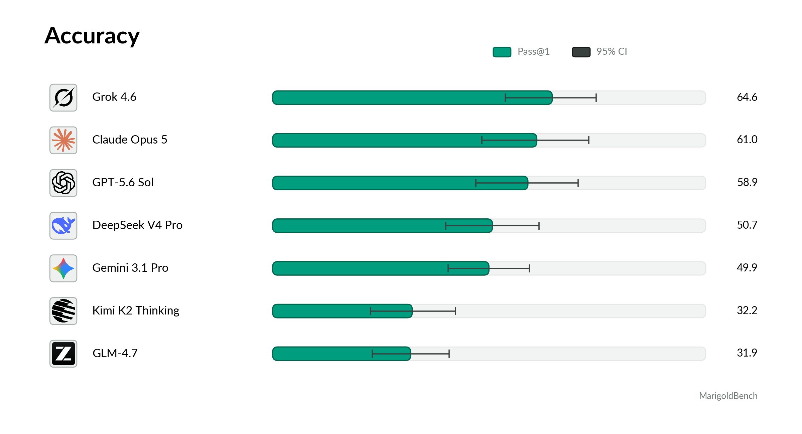

# MarigoldBench

**A model is handed a working computational drug-discovery lab and measured on
whether it drives that lab to a defensible result.**

Structure prediction, protein design, docking, generative chemistry, RDKit and a
Python sandbox. Eleven tools, a step budget, a brief, and a deterministic
verifier that **recomputes every physical and statistical claim from the
submitted artefact**. Nothing the model says about its own work counts as
evidence.

Seven frontier systems, 4,923 recorded episodes, every transcript published.

Dataset and full results: **https://huggingface.co/datasets/rasynai/MarigoldBench**



| System | n | Pass@1 | 95% CI (family-clustered) | Pass^3 |
|---|---|---|---|---|
| Grok 4.6 | 804 | **64.6%** | [53.8, 74.9] | 54.0% |
| Claude Opus 5 | 810 | 61.0% | [48.4, 73.2] | 50.4% |
| GPT-5.6 Sol | 806 | 58.9% | [46.9, 70.7] | 50.4% |
| DeepSeek V4 Pro | 270 | 50.7% | [39.6, 61.5] | - |
| Gemini 3.1 Pro | 809 | 49.9% | [40.5, 59.3] | 33.1% |
| Kimi K2 Thinking | 270 | 32.2% | [22.2, 42.6] | - |
| GLM-4.7 | 270 | 31.9% | [23.0, 40.7] | - |

**Read the intervals, not the ranking.** Episodes inside a task type share a
generator; the measured intraclass correlation is 0.40, so a naive binomial
interval is 2.9x too narrow. This release separates the top group from the
bottom two and **cannot** rank Grok, Claude and GPT against each other.

**Corrected on 2026-08-20.** Reading the recorded transcripts found three
defects in the benchmark rather than in the models: a tool sandbox that confined
the file tool and not the interpreter (CORR-014), a checkpoint that read a
ruled-out explanation as a claim (CORR-015), and a submit handler that dropped
73 of one model's answers and none of another's (CORR-016). Everything is
re-scored, 12 contaminated episodes are voided, and Claude moved from 57.9 to
61.0 percent, which changed the order of second and third place.

## How it works

**The answer key cannot be wrong.** Deterministic generators fabricate the data
and therefore know every answer, which puts label error near zero where every
other benchmark in the field carries 8 to 29 percent.

**Three conditions per task type, two of them byte-identical.**

- **Sound.** The reported concern is a false alarm; raising one is a failure.
- **Planted defect.** A real flaw that changes the answer, in a brief worded
  identically to the sound version.
- **Unanswerable.** The question cannot be answered as asked; a documented
  refusal with an explicit impossibility witness is the only correct outcome and
  silence scores zero.

**Anti-saturation is enforced.** An earlier version saturated at 94 to 100
percent because briefs printed method recipes and answer menus. That failure is
published in full, and the giveaway classes it identified are now rejected by
build gates.

## Layout

| Path | Contents |
|---|---|
| `crucible/lab/fam/` | The 30 task-type generators and verifiers, answer keys included |
| `crucible/lab/` | The frozen agent loop, the 11-tool belt, the campaign runner, the scorer |
| `runs/gate_families.py` | The gate that decides which task types may be scored |
| `runs/check_goal.py` | The 22 stop conditions for the release |
| `runs/_figures_house.py` | Every figure, regenerated from recomputed data |
| `docs/AUDIT.md` | Audit, including seven defects found in our own claims |
| `docs/LIMITATIONS.md` | What these numbers cannot support |
| `CORRECTIONS.md` | Every material error in construction, scoring or conduct |
| `GOAL.md` | The stopping contract this release was built against |

Episode records live with the dataset on Hugging Face, not here.

## Reproducing

```bash
pip install -e .                  # Python >= 3.11
python runs/gate_families.py      # must read 30/30 before anything is scored
python -m crucible.lab.scorecard  # rebuild the scorecard from the episodes
python runs/check_goal.py         # 22/22 stop conditions
```

Running new episodes needs provider credentials and a free NVIDIA NIM key for
the structural-biology tools. `docs/REPLICATION.md` pins the versions.

## Read the audit first

[`docs/AUDIT.md`](docs/AUDIT.md) recomputes every published number with code
written for the audit rather than the code that produced it, and it leads with
what it found wrong with us: the card advertised six integrity gates where four
are mechanically enforced; the intraclass correlation was quoted as 0.26 and is
0.40; the hard-task band is selected on the episodes it then scores; and
reasoning effort was set high for Claude and GPT and left at each provider's
default for the other five. Grok still finished first without it.

Security note, in two parts, both ours. The sandbox used to pass the harness's
environment to model-authored code, so a model printing `os.environ` read our
provider keys (CORR-013). It also confined the file tool and not the
interpreter, so 371 episodes reached the network, 42 used one of those keys, and
one read the grader source for the task it was being scored on (CORR-014). Both
are closed and both have tests. If you build an agent harness: pass `env=`, and
install an audit hook, because a tool-level path check is not a sandbox.

## CRUCIBLE-CHAIN

The sibling track in this repository, evaluating scientific reasoning under
attractive error as a chain of 5 to 8 judgment calls where every stage offers a
plausible wrong path. It keeps its own name, its own gates and its own
corrections; see `crucible/chain/` and the CORRECTIONS ledger.

Apache-2.0. The literature PDFs used in the design review are not redistributed;
the synthesis notes under `analysis/` are ours.
